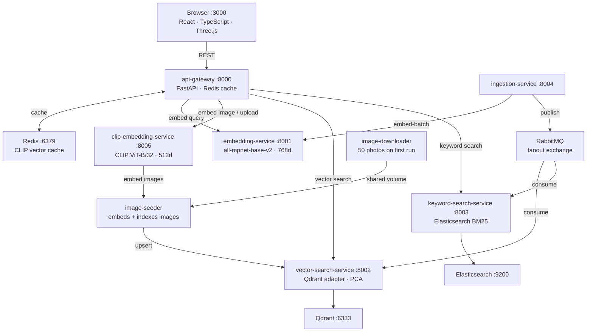

# Search Arena

**Not a library. Not a framework. A git clone.**

```bash
git clone https://github.com/orhangezginci/search-arena.git
cd search-arena
# add your pipeline
# docker compose up
# done
```

Search Arena is a fully working semantic search stack you clone and extend by adding one service. The core — vector search, keyword search, hybrid ranking, embeddings, event bus — is already running. You bring the content: PDFs, emails, calendar entries, anything. Drop a new ingestion service into `docker-compose.yml` and the rest handles itself.

> No `pip install search-arena`. No wrapping imports. No framework to learn.  
> Clone it, run it, add your pipeline, search your content.


---

## What This Project Demonstrates

### 1. Semantic vs Keyword vs Hybrid Search — side by side
Three engines run on every query simultaneously. Semantic search understands *meaning*, BM25 matches *tokens*, and hybrid (Reciprocal Rank Fusion) combines both — promoting results that appear in both lists and demoting results that only one engine sees.

### 2. Hybrid Search with Reciprocal Rank Fusion
The hybrid column isn't a simple average — it's a rank-fusion algorithm that correctly handles the case where neither engine alone gets the answer right.

```
score = 0.7 / (semantic_rank + K) + 0.3 / (keyword_rank + K)   K = 60
```

Only semantic candidates qualify. Keyword-only results are excluded. The benchmark query `street food quick and spicy` demonstrates this cleanly: semantic picks Vindaloo (spicy), keyword picks Chicken Noodle Soup (noodle), hybrid picks Pad Thai — the one result both engines independently agreed belongs in the conversation.

### 3. Multi-Modal Search with CLIP
A second mode lets you search **50 photos using natural language** — no filenames, no tags, no metadata. The images are stored under opaque names (`img_001.jpg` … `img_050.jpg`). CLIP embeds your text and the images into the same 512-dimensional vision-language space and matches by cosine similarity. Keyword search returns zero results — there is nothing to tokenise.

### 4. Image Upload — find visually similar images
Drop your own photo into the Upload tab. CLIP embeds it on the fly, searches the indexed collection, and returns visually similar results. Each result shows:
- **Cosine similarity score** and **collection percentile** — "top 4% of 50"
- **Concept chips** — vocabulary probes (28 visual concepts cached in Redis) explain which visual properties drove each match
- **Animated ingestion pipeline** — shows every step from upload to result with real per-step timings on hover

### 5. The Adapter Pattern on Vector Databases
All vector DB operations go through an abstract `VectorDBAdapter` interface. Qdrant is the current implementation — swappable for ChromaDB, Weaviate, or Pinecone by changing a single config value, with zero changes to any other service.

```python
class VectorDBAdapter(ABC):
    def create_collection(self, name: str, dimension: int) -> None: ...
    def insert(self, collection, ids, vectors, payloads) -> None: ...
    def search(self, collection, vector, limit, score_threshold) -> list: ...
```

### 6. Event-Driven Microservice Architecture
Ingestion publishes to a **RabbitMQ fanout exchange**. Vector search and keyword search consume independently — fully decoupled. Adding a new index means adding a new consumer, not touching existing code.

```
POST /ingest
     │
     ▼
[ingestion-service] ──► [embedding-service]
     │
     ▼
[RabbitMQ fanout exchange]
     ├──► [vector-search-service]  →  Qdrant
     └──► [keyword-search-service] →  Elasticsearch
```

### 7. Redis Embedding Cache
Concept vectors computed by CLIP are cached in Redis on first use. All 50 image vectors are pre-loaded into Redis at api-gateway startup. Repeated queries hit the cache — no redundant model inference.

### 8. 3D Embedding Space Visualisation
Every recipe search renders a live **PCA-reduced 3D projection** of the embedding space using React Three Fiber. Points are heatmap-coloured by cosine similarity — cold blue for distant, pulsing neon for the closest match.

### 9. Where Small Language Models Hit Their Limit
Searching `a romantic dinner for two` returns weak results — intentionally. `all-mpnet-base-v2` excels at paraphrase similarity but can't bridge ingredient lists to social occasion semantics. The architecture is model-agnostic; swapping is a one-line change in the embedding service.

---

## The Demos

### Recipe Search — semantic wins
Type `I have a hangover`.

Semantic returns **Bloody Mary** and **Pho Bo**. Keyword returns nothing — "hangover" doesn't appear in any recipe. That gap is the whole point.

### Recipe Search — hybrid wins
Type `street food quick and spicy`.

| Engine | #1 result | Why |
|---|---|---|
| Semantic | Chicken Vindaloo | fixates on "spicy" |
| Keyword | Chicken Noodle Soup | token overlap, no understanding |
| **Hybrid** | **Pad Thai** | ranked in both lists — fusion promotes consensus |

### Image Search
Type `dramatic stormy ocean`. CLIP finds the matching photos. Keyword returns zero — there are no words to match. The concept chips on each result show which visual properties drove the match.

### Image Upload
Drop any photo into the Upload tab. Watch the animated pipeline show CLIP embedding → Qdrant search → concept vocabulary explanation in real time, with millisecond timings on each step.

---

## Quick Start

```bash
git clone https://github.com/orhangezginci/search-arena.git
cd search-arena
docker compose up -d --build
```

Docker Compose handles the full startup sequence automatically:

1. Redis, RabbitMQ, Qdrant, Elasticsearch start and pass healthchecks
2. Embedding, vector-search, keyword-search, CLIP services start
3. Image downloader fetches 50 photos into a shared volume
4. Image seeder embeds and indexes all 50 images into Qdrant
5. Recipe seeder loads 20 curated recipes into the pipeline
6. API gateway and frontend start

Open **http://localhost:3000**

> First boot takes several minutes — the embedding service downloads `all-mpnet-base-v2` (~420 MB) and the CLIP service downloads `clip-ViT-B-32` (~350 MB). Subsequent restarts are fast.

---

## Try These Queries

### Recipe Search

| Query | Semantic finds | Keyword finds | Hybrid advantage |
|---|---|---|---|
| `I have a hangover` | Bloody Mary, Pho Bo | ✗ nothing | — |
| `I have the flu` | Honey Ginger Tea, Chicken Soup | ✗ nothing | — |
| `street food quick and spicy` | Vindaloo | Chicken Noodle Soup | ✓ Pad Thai |
| `szechuan` | noisy | ✓ exact match | keyword wins |
| `something cooling on a hot day` | Gazpacho, Watermelon Salad | ✗ nothing | — |

### Image Search

| Query | CLIP finds | Keyword finds |
|---|---|---|
| `romantic sunset at the beach` | beach/ocean photos | ✗ impossible |
| `something dramatic and stormy` | storm/cliff photos | ✗ impossible |
| `cozy morning coffee` | café/morning photos | ✗ impossible |
| `joy and laughter` | children/celebration photos | ✗ impossible |

---

## Architecture



## Services

| Service | Port | Stack |
|---|---|---|
| frontend | 3000 | React, TypeScript, Framer Motion, React Three Fiber |
| api-gateway | 8000 | FastAPI, Redis client |
| embedding-service | 8001 | FastAPI, sentence-transformers (`all-mpnet-base-v2`, 768d) |
| vector-search-service | 8002 | FastAPI, Qdrant, scikit-learn (PCA) |
| keyword-search-service | 8003 | FastAPI, Elasticsearch 8.12 BM25 |
| ingestion-service | 8004 | FastAPI, pika (RabbitMQ) |
| clip-embedding-service | 8005 | FastAPI, sentence-transformers (`clip-ViT-B-32`, 512d) |
| redis | 6379 | Redis 7 (CLIP vector cache) |
| qdrant | 6333 | Qdrant (persisted volume) |
| elasticsearch | 9200 | Elasticsearch (persisted volume) |
| rabbitmq | 5672 / 15672 | RabbitMQ with management UI |
| image-downloader | — | Downloads 50 photos on first run, exits |
| image-seeder | — | Embeds and indexes all images, exits |

## Dashboards

| Dashboard | URL |
|---|---|
| App | http://localhost:3000 |
| RabbitMQ Management | http://localhost:15672 (guest / guest) |
| Qdrant Dashboard | http://localhost:6333/dashboard |
| Elasticsearch | http://localhost:9200 |
| Swagger (any service) | http://localhost:800X/docs |

---

## Roadmap

The path from demo to scaffold runs through three phases: a **PDF pipeline** (first real-world extension, proves the pattern), a **config-driven core** (removes hardcoded assumptions), and a **CLI wizard** (`create-search-arena --pdf --library-frontend`) that lets any developer scaffold a custom search system in one command. MCP integration is an optional layer on top for LLM-powered querying.

See [ROADMAP.md](ROADMAP.md) for the full plan.
