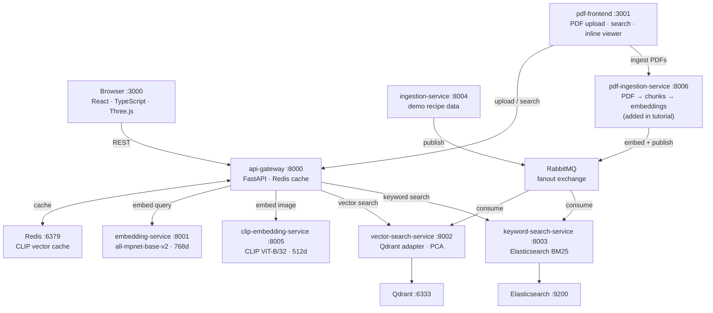

# Search Arena

**Not a library. Not a framework. A git clone.**

Search Arena is a ready-to-run search backend with semantic, keyword, and hybrid search — extend it by adding one ingestion service for your data. Designed for real-world use cases, not demos.

No SDK. No framework lock-in. No hidden magic.

### TL;DR
- Clone → run → you have semantic + keyword + hybrid search
- Add one ingestion service for your data
- Done

```bash
git clone https://github.com/orhangezginci/search-arena.git
cd search-arena
docker compose up -d --build
# open http://localhost:3000
# you're searching in ~3 minutes
```

> No library to install. No framework to learn. No glue code to write.

Most semantic search setups require stitching together embeddings, vector databases, keyword search, and APIs yourself. Search Arena gives you that entire stack already wired. You only add your data pipeline.

No schema design. No search tuning. No ranking logic. It just works.

### Who this is for
- Developers building search into their product
- Side projects that need real search without the setup
- Teams prototyping search systems fast

### Hybrid search fixes what each method gets wrong

Semantic misses precision. Keyword misses meaning. Hybrid combines both — and always picks the right answer.


### Search images by meaning — no tags, no filenames

Type natural language. CLIP matches by visual semantics, not metadata.


---

## Mental Model

Search Arena works through one simple idea:

> You publish documents → everything else happens automatically

Think of it as a search engine you plug your data into.

```
Search Arena = Core  +  Your Pipeline

Core (runs out of the box):
  Embeddings       → converts any text to vectors
  Vector Store     → Qdrant, cosine similarity search
  Keyword Engine   → Elasticsearch BM25
  Hybrid Ranking   → Reciprocal Rank Fusion across both
  API Gateway      → single /search endpoint for everything
  Search UI        → side-by-side live comparison

Your Pipeline (one new service):
  Ingestion        → read your content → chunk it → publish to event bus
                     the core handles everything from there
```

Every ingestion service, no matter what it processes, emits messages in this format:

```json
{ "text": "...", "title": "...", "collection": "your-name" }
```

That's it. Add any extra fields — they're stored and returned automatically.

---

## What you can build

| Outcome | What to add |
|---|---|
| Search across thousands of PDFs | one PDF ingestion service |
| Search your emails like ChatGPT | connect an IMAP ingestion service |
| Search your calendar and meetings | ingest iCal / Google Calendar exports |
| Search your knowledge base | ingest markdown, Notion exports, wikis |
| Search images by natural language | already built in — CLIP text → image |

Every use case follows the same pattern: **one new service, one block in docker-compose.yml**.

---

## Included demos

The default setup ships with four reference implementations of the pattern. These are not toy examples — they are the same architecture you will use for your own data.

### Recipe search
Semantic vs keyword vs hybrid, side by side.

| Query | Semantic | Keyword | What it shows |
|---|---|---|---|
| `I have a hangover` | ✓ Bloody Mary | ✗ nothing | semantic understands context, keyword finds no literal match |
| `szechuan` | ✓ Szechuan Mapo Tofu | ✓ Szechuan Mapo Tofu | both badges — exact word in the title |
| `pad thai` | ✓ Pad Thai | ✓ Pad Thai | both badges — when engines agree, hybrid boosts confidence |
| `something warm and comforting on a cold evening` | ✓ Hot Toddy | ✗ nothing | pure semantic — no keyword in the collection matches this |

### PDF search — http://localhost:3001
The PDF search UI ships out of the box and is ready and waiting at :3001. To make it functional you need to add a PDF ingestion service — that is exactly what the tutorial walks you through.

Once you have completed the tutorial, the UI gives you:

- **Load demo data** — one click seeds five original documents across diverse topics (Transformers, Black Holes, Reinforcement Learning, Epidemiology, Climate)
- **Upload your own PDFs** — drag and drop or file picker, page-level chunking and embedding happens automatically
- **Semantic + keyword + hybrid** — every result shows which engines matched it (blue `semantic` / amber `keyword` badges)
- **Inline PDF viewer** — click any result to open the source PDF at the exact page
- **Clear knowledge base** — one button wipes Qdrant + Elasticsearch so you can start fresh

👉 **[Follow the tutorial to wire it up](docs/tutorial.md)**

Example queries once demo data is loaded:

| Query | Semantic | Keyword | What it shows |
|---|---|---|---|
| `event horizon telescope` | ✓ black hole p.2 | ✓ black hole p.2 | both badges — exact technical name in the text |
| `self-attention mechanism transformer` | ✓ transformers p.1 | ✓ transformers p.1 | both badges — domain terminology matches exactly |
| `presymptomatic transmission` | ✓ epidemiology p.2 | ✓ epidemiology p.2 | both badges — medical term present verbatim |
| `how does a star collapse into a black hole` | ✓ black hole p.1 | ✗ nothing | semantic only — concept understood, words not found |
| `virus spreads before symptoms appear` | ✓ epidemiology p.2 | ✗ nothing | semantic only — natural language, no exact match |

### Image search
CLIP-based natural language retrieval over 50 photos with no filenames or tags. Type `dramatic stormy ocean`. Keyword returns zero — there is nothing to tokenise. CLIP finds the right photos by meaning.

### Upload pipeline
Drag and drop your own image. Watch the real-time ingestion pipeline embed it via CLIP, search the collection, and explain the match through visual concept probes.

**Replace these pipelines with your own. The core does not change.**

---

## Run it

Already cloned? Start everything:

```bash
docker compose up -d --build
```

Open **http://localhost:3000** — you now have a fully working search system.

> First boot takes a few minutes — embedding models download automatically (~770 MB total). Subsequent restarts are instant.

👉 Full tutorial: [build your PDF ingestion service — the search frontend at :3001 is already waiting](docs/tutorial.md)

Try these queries to see the three engines compared live:

| Query | Semantic | Keyword | What it shows |
|---|---|---|---|
| `I have a hangover` | ✓ Bloody Mary | ✗ nothing | semantic understands intent, keyword is lost |
| `szechuan` | ✓ Szechuan Mapo Tofu | ✓ exact match | keyword wins on a proper noun |
| `pad thai` | ✓ Pad Thai | ✓ Pad Thai | hybrid boosts confidence when both engines agree |
| `something warm and comforting on a cold evening` | ✓ Hot Toddy | ✗ nothing | pure semantic — no recipe title contains these words |

---

## Extend it

### Where to plug in

| What you want | Where to add it |
|---|---|
| New content type (emails, wikis…) | `services/your-ingestion-service/` |
| New search collection | `collection` param on `/search` — nothing to configure |
| Different embedding model | `services/embedding-service/main.py` — one line |
| Different vector database | `services/vector-search-service/adapter.py` — swap implementation |
| PDF search | UI already running at **http://localhost:3001** — follow the tutorial to add the ingestion service |
| Custom frontend | call `POST /search` with your collection name |

### The pattern

```
1. Create services/your-ingestion-service/
   → read your content
   → chunk it
   → publish to RabbitMQ exchange "ingestion.events"

2. Add one block to docker-compose.yml

3. Done — vector search, keyword search, hybrid ranking
   all work on your content automatically
```

### The contract

Every ingestion service publishes one message per chunk to the `ingestion.events` RabbitMQ fanout exchange:

```json
{
  "collection": "my-docs",
  "id": "stable-uuid",
  "text": "...",
  "vector": [0.1, 0.2, ...],
  "metadata": { "title": "report.pdf — p.4", "source": "report.pdf", "page": 4 }
}
```

Search Arena automatically indexes it into Qdrant + Elasticsearch and makes it searchable via `POST /search` with semantic, keyword, and hybrid ranking. No additional wiring required.

The tutorial walks you through building a `pdf-ingestion-service` that implements this pattern — `services/pdf-ingestion-service/` in the repo is the finished reference implementation.

👉 Full walkthrough: [docs/tutorial.md](docs/tutorial.md)

---

## Architecture

If you're curious how it works internally:



## Services

| Service | Port | Role |
|---|---|---|
| frontend | 3000 | Live search UI with 3D embedding space |
| pdf-frontend | 3001 | PDF library, upload, search, inline viewer with per-result method badges |
| api-gateway | 8000 | Unified search API, hybrid ranking |
| embedding-service | 8001 | Text → 768d vectors (all-mpnet-base-v2) |
| vector-search-service | 8002 | Qdrant adapter, PCA projection |
| keyword-search-service | 8003 | Elasticsearch BM25 |
| ingestion-service | 8004 | Recipe demo data ingestion via RabbitMQ |
| clip-embedding-service | 8005 | Image + text → 512d CLIP vectors |
| pdf-ingestion-service | 8006 | PDF → page chunks → embeddings → RabbitMQ _(added in tutorial)_ |
| redis | 6379 | Embedding vector cache |
| qdrant | 6333 | Vector store (persisted) |
| elasticsearch | 9200 | Keyword index (persisted) |
| rabbitmq | 5672 / 15672 | Fanout event bus |

## Dashboards

| | URL |
|---|---|
| Recipe + image search | http://localhost:3000 |
| PDF search | http://localhost:3001 |
| PDF ingestion API | http://localhost:8006/docs _(after tutorial)_ |
| API Swagger | http://localhost:8000/docs |
| RabbitMQ | http://localhost:15672 (guest / guest) |
| Qdrant | http://localhost:6333/dashboard |
| Elasticsearch | http://localhost:9200 |

---

## Roadmap

- ~~PDF ingestion pipeline out of the box~~ — shipped: tutorial + reference implementation in `services/pdf-ingestion-service/`, UI ready at :3001
- Config-driven setup (reduce custom code to near zero)
- `create-search-arena` CLI — spin up your own search system in seconds

See [ROADMAP.md](ROADMAP.md) for the full plan.
