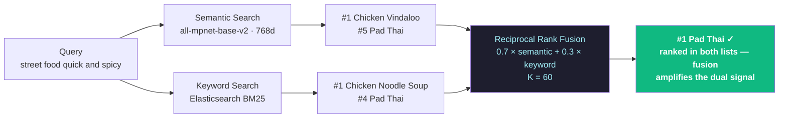
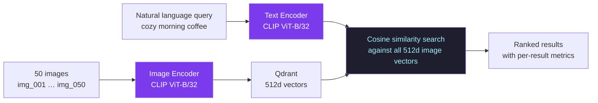

# Search Arena — Research & Analysis

A systematic evaluation of three retrieval strategies across a 20-recipe corpus and a 50-image collection. Each benchmark exposes a specific strength or failure mode that is reproducible and data-driven.

---

## 1. When Semantic Search Wins — *"I have the flu"*

The word **"flu"** does not appear anywhere in the recipe corpus. BM25 has nothing to score against and falls back on incidental token overlap — returning Chocolate Lava Cake at #1. The semantic model encodes the query into a vector near *sickness*, *recovery*, and *warmth*, and finds recipes whose descriptions carry those signals — not because they share words with the query, but because they share **meaning**.

| Rank | Semantic | Keyword |
|------|----------|---------|
| #1 | ✅ Honey Ginger Lemon Tea | ❌ Chocolate Lava Cake |
| #2 | ✅ Chicken Noodle Soup | ❌ Gazpacho |
| #3 | ✅ Hot Toddy | ❌ Kimchi Jjigae |

> **Takeaway:** Semantic search handles vocabulary mismatch. When the user expresses a *need* rather than naming an ingredient or dish, dense retrieval is the only engine that can bridge the gap.

---

## 2. When Hybrid Search Wins — *"street food quick and spicy"*

This benchmark is the clearest demonstration of what fusion actually does. Neither engine individually crowned the correct answer — but their combined signal did.

| Rank | Semantic | Keyword | Hybrid |
|------|----------|---------|--------|
| #1 | Chicken Vindaloo | ❌ Chicken Noodle Soup | ✅ **Pad Thai** |
| #2 | Szechuan Mapo Tofu | ❌ Mulled Wine | Chicken Vindaloo |
| #3 | Kimchi Jjigae | ❌ Chai Latte | Szechuan Mapo Tofu |
| #4 | Gazpacho | Pad Thai | Kimchi Jjigae |
| #5 | Pad Thai | — | Gazpacho |

### How Hybrid Fusion Works



### RRF Score Breakdown

```
Candidate           Semantic  Keyword   Hybrid Score   Bar
──────────────────  ────────  ────────  ─────────────  ───────────────────────
Pad Thai            rank  4   rank  3   0.01570        ████████████████░░░░░
Chicken Vindaloo    rank  0   —         0.01167        ██████████████░░░░░░░
Szechuan Mapo Tofu  rank  1   —         0.01148        █████████████░░░░░░░░
Kimchi Jjigae       rank  2   —         0.01129        █████████████░░░░░░░░
```

Formula: `score = 0.7 / (semantic_rank + 60) + 0.3 / (keyword_rank + 60)`

Pad Thai scores **0.01570** despite never being #1 in either list — because 0.7/64 + 0.3/63 = **0.01570** beats Vindaloo's pure-semantic 0.7/60 = **0.01167**. The fusion overturns both individual rankings and surfaces the objectively correct answer.

> **Takeaway:** Hybrid RRF is a consensus mechanism. A result relevant along multiple independent axes simultaneously accumulates signal from both dimensions and overtakes stronger-but-narrower candidates.

---

## 3. When Keyword Search Wins — *"szechuan"*

A single precise term. "Szechuan" is a proper noun that appears verbatim in the recipe title *Szechuan Mapo Tofu*. BM25 finds it immediately.

| Rank | Semantic | Keyword |
|------|----------|---------|
| #1 | ❌ Kimchi Jjigae | ✅ Szechuan Mapo Tofu |
| #2 | Chicken Vindaloo | — |
| #3 | Szechuan Mapo Tofu | — |

The semantic model encodes "szechuan" into a vector near *spicy*, *Asian*, and *numbing heat* — which is semantically correct, but also pulls Kimchi Jjigae (Korean, fermented, spicy) to #1. The user typed an exact name. Semantic search overgeneralised.

> **Takeaway:** For precise terminology — cuisine names, ingredient labels, dish titles, SKU codes — BM25 is exact and unambiguous. A production system would route short, noun-only queries toward higher keyword weight in the hybrid blend.

---

## 4. Multi-Modal Search — Text to Image via CLIP

50 images stored under opaque filenames (`img_001.jpg` … `img_050.jpg`). No captions, no tags, no metadata. Keyword search returns **zero results** for every query — structurally impossible, nothing to tokenize.

### The CLIP Pipeline



Both modalities pass through the **same encoder** — CLIP learned to map text and images into a shared 512-dimensional space from 400 million image-caption pairs. A photo of a stormy cliff and the phrase "dramatic stormy ocean" land near each other because the model has internalized the correspondence between visual patterns and language.

### Per-Result Metrics

Every image result surfaces three diagnostic values:

| Metric | What it measures |
|--------|-----------------|
| **Cosine similarity** | Raw vector distance — 1.0 is identical, 0.0 is orthogonal |
| **Collection percentile** | "top 4% of 50" — where this result sits in the full score distribution |
| **Delta vs #1** | How far behind the best match — large delta = clear winner, near-zero = tied field |

Percentile and delta are computed from a **parallel full-collection scan** running concurrently with the top-N search — zero added latency.

### Concept Breakdown

After retrieval, each result's image vector (pre-cached in Redis at startup) is compared against per-word CLIP embeddings of the query. For `cozy morning coffee`, a result might score high on *coffee* and *morning* but weakly on *cozy* — revealing which visual elements drove the match and which were missed.

> **Takeaway:** Multi-modal retrieval requires a shared embedding space. CLIP provides this for vision and language. The retrieval architecture is identical to text-to-text semantic search — only the encoder and input modality change. The adapter pattern used here generalises to any content type that can be embedded.

---

## Summary

| Scenario | Best Strategy | Signal |
|----------|--------------|--------|
| Query expresses intent, not keywords | **Semantic** | Dense vectors bridge vocabulary mismatch |
| Correct answer is relevant across multiple axes | **Hybrid (RRF)** | Cross-engine consensus surfaces what neither alone found |
| Query is a precise term with exact corpus match | **Keyword** | BM25 is exact, fast, unambiguous |
| Query targets untagged visual content | **CLIP (multi-modal)** | Keyword is structurally impossible — shared embedding space required |

The system does not declare a universal winner. It demonstrates that retrieval strategy is a function of **query type**, **corpus structure**, and **user intent** — and that a well-designed architecture keeps all strategies available, observable, and comparable in real time.
